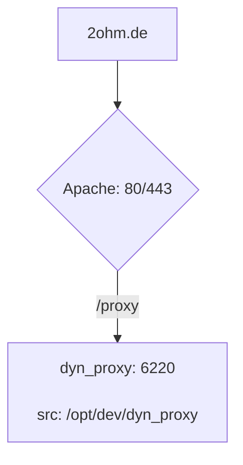

## Setup

This repository is using ansible roles from the [Ansible Rolorama](https://github.com/akaiser/ansible-rolorama) repository.

```shell
# Clone the ansible-rolorama repository at the same directory level as this repository.
git clone https://github.com/akaiser/ansible-rolorama.git

# Creating the symlink is only required when introducing new roles.
cd dyn-proxy/.ansible/roles
ln -s ../../../ansible-rolorama/systemd_unit/java_service __java_service
```

## General use:

```shell
# run the complete playbook
ansible-playbook dyn_proxy.yml

# list all available tags
ansible-playbook dyn_proxy.yml --list-tags

# run with a specific tag
ansible-playbook dyn_proxy.yml --tags deploy

# dry-run
ansible-playbook dyn_proxy.yml --tags deploy --check
```

## Logging

- DynProxy: `tail -F /opt/dev/_log/dyn_proxy.log`

## Routing Setup


