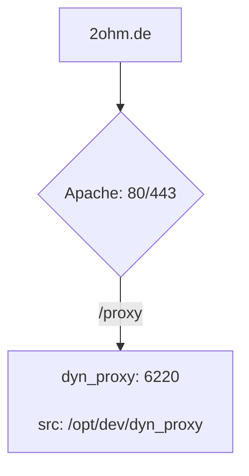

## General use:

```shell
# run the complete playbook
ansible-playbook dyn_proxy.yml

# list all available tags
ansible-playbook dyn_proxy.yml --list-tags

# run with a specific tag
ansible-playbook dyn_proxy.yml --tags deploy

# dry-run
ansible-playbook dyn_proxy.yml --tags deploy --check
```

## Logging

- DynProxy: `tail -F /opt/dev/_log/dyn_proxy.log`

## Routing Setup



## MISC

Shall we?

https://laravel-news.com/deploy-your-php-app-with-ansible-and-github-actions

https://networkbrouhaha.com/2020/05/ansible-with-github-actions/
